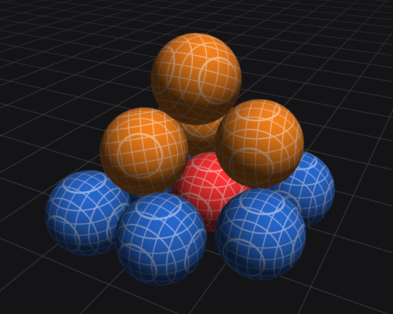

# Tipsy Tower

[Ludum Dare 59 Compo entry](https://ldjam.com/events/ludum-dare/59/tipsy-tower)

A small game (made in 6 hours) that uses my [own physics engine](https://github.com/timo-eberl/tics) (not made in 6 hours).

Stack spheres to create a (signal) tower!



## Web Build

```
emcmake cmake -S . -B build_wasm/ -DCMAKE_BUILD_TYPE=Release && cmake --build build_wasm/
emrun build_wasm/tower-stack.html
```
